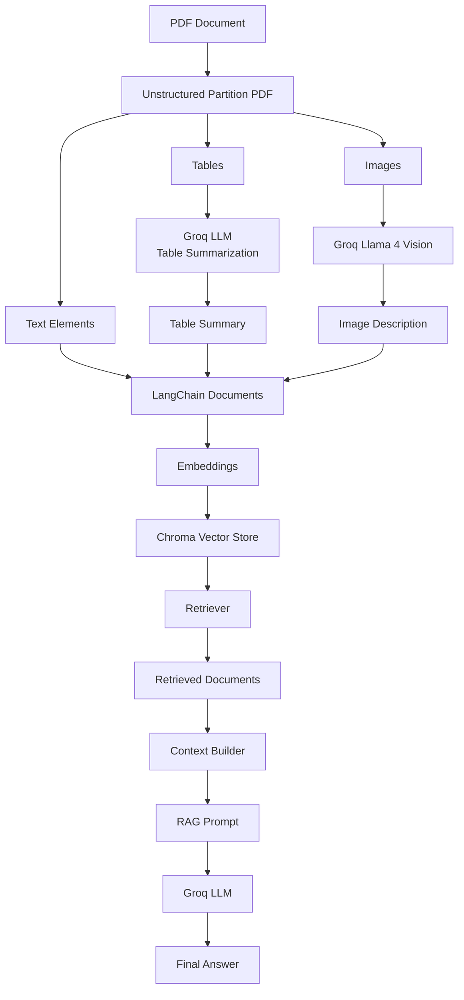

## Multimodal Financial RAG Assistant 
  ### Python, LangChain, Unstructured, ChromaDB, Groq, Vision LLMs

• Built a multimodal Retrieval-Augmented Generation (RAG) system for querying financial reports containing text, tables, charts, and figures.

• Developed a document processing pipeline using Unstructured to extract narrative text, tables, figure captions, and images from PDF documents.

• Generated retrieval-optimized summaries of financial tables using LLMs and converted visual content into searchable text using vision-language models.

• Created a unified vector knowledge base using embeddings and ChromaDB, enabling semantic search across textual, tabular, and visual information.

• Implemented metadata-aware retrieval with support for source tracing, page references, table HTML preservation, and image-path based figure retrieval.

• Designed a context-aware question-answering pipeline that combines information from text sections, financial tables, and chart descriptions to generate accurate responses.

## Architecture
                   
                    
        # Architecture



```
```
